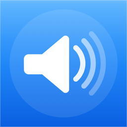

# AudioCore

<p align="center">
  
</p>

Приложение-микшер для macOS: живёт в строке меню и позволяет управлять громкостью **отдельных приложений** независимо от общей громкости системы — как микшер приложений в Windows, только на Mac.

Работает через нативный Core Audio Process Tap API — перехватывает аудиопоток конкретного приложения, применяет к нему свой gain/mute и подмешивает результат в реальное устройство вывода. Само приложение никакого звука не проигрывает — это прозрачная прослойка между таргет-приложениями и колонками/наушниками.

## Возможности

- Отдельный слайдер громкости (0–150%) для каждого приложения, которое сейчас издаёт звук
- Mute конкретного приложения без влияния на остальные
- Список приложений обновляется автоматически — не нужно ничего настраивать вручную
- Управление громкостью через Siri Shortcuts / Control Center intents (`AudioCoreControl`)
- Настройки громкости сохраняются между запусками приложений и перезапусками AudioCore
- Автозапуск при входе в систему

## Требования

- macOS 26 или новее
- Xcode 17+
- [XcodeGen](https://github.com/yonaskolb/XcodeGen) для генерации `.xcodeproj`

## Сборка

Проект описан декларативно в [`project.yml`](project.yml) — `.xcodeproj` в репозитории не хранится и генерируется на месте:

```bash
brew install xcodegen   # если ещё не установлен
xcodegen generate
open AudioCore.xcodeproj
```

Дальше — обычная сборка (`⌘R`) или архивация через Xcode/`xcodebuild`.

## Подпись и распространение

По умолчанию проект настроен на **самоподписанный сертификат** (`CODE_SIGN_STYLE: Manual` в `project.yml`) — это позволяет собирать и распространять приложение полностью бесплатно, без Apple Developer Program, и без 7-дневного протухания, характерного для бесплатной автоподписи Xcode.

Ограничение такого подхода: entitlement `com.apple.security.application-groups` требует настоящий provisioning profile от Apple вне зависимости от способа подписи, поэтому расширение **Control Center** (`AudioCoreControl`) в самоподписанную сборку не входит — работает только основное приложение в строке меню. Чтобы включить виджет Control Center, нужно платное членство Apple Developer Program ($99/год): переключить `DEVELOPMENT_TEAM` на реальный Team ID, `CODE_SIGN_STYLE` на `Automatic`, вернуть зависимость `AudioCoreControl` в таргет `AudioCore` в `project.yml` и подписать Developer ID для нотаризации.

При первом запуске самоподписанной сборки Gatekeeper покажет предупреждение «неизвестный разработчик» — это ожидаемо, поскольку сборка не нотаризована Apple. Обходится один раз: правый клик по `AudioCore.app` → «Открыть», либо `xattr -cr AudioCore.app` в терминале.

## Разрешения

Приложению нужно разрешение **System Audio Recording** (запись системного звука) — без него звук у затронутых приложений будет полностью тихим. Разрешение запрашивается автоматически при первом запуске; если что-то пошло не так, приложение покажет баннер с прямой ссылкой в Privacy & Security.

## Архитектура

- `AudioMixerEngine` — координирует, какие приложения сейчас затронуты (имеют живой tap) и с каким gain/mute
- `AggregateMixerDevice` — владеет единым агрегированным устройством вывода и IO-коллбэком реального времени, который смешивает все активные tap'ы в один поток
- `MixerRenderMath` — чистая математика сведения сэмплов, без обращений к Core Audio — покрыта юнит-тестами
- `VolumeManager` — координатор уровня приложения: опрашивает список активных приложений, хранит состояние в App Group, синхронизируется с расширением Control Center через Darwin-уведомления
- `AudioCoreControl` — расширение с App Intents для Siri Shortcuts и Control Center

Все обращения к реальному аудио-потоку выполняются без блокировок и аллокаций в real-time-колбэке — управляющий поток публикует неизменяемый снэпшот состояния под `os_unfair_lock`, а аудиопоток читает его через неблокирующий `trylock`.
